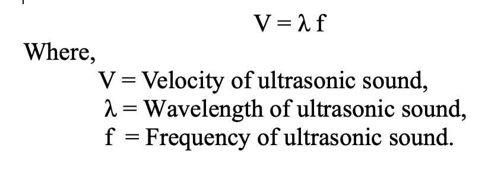
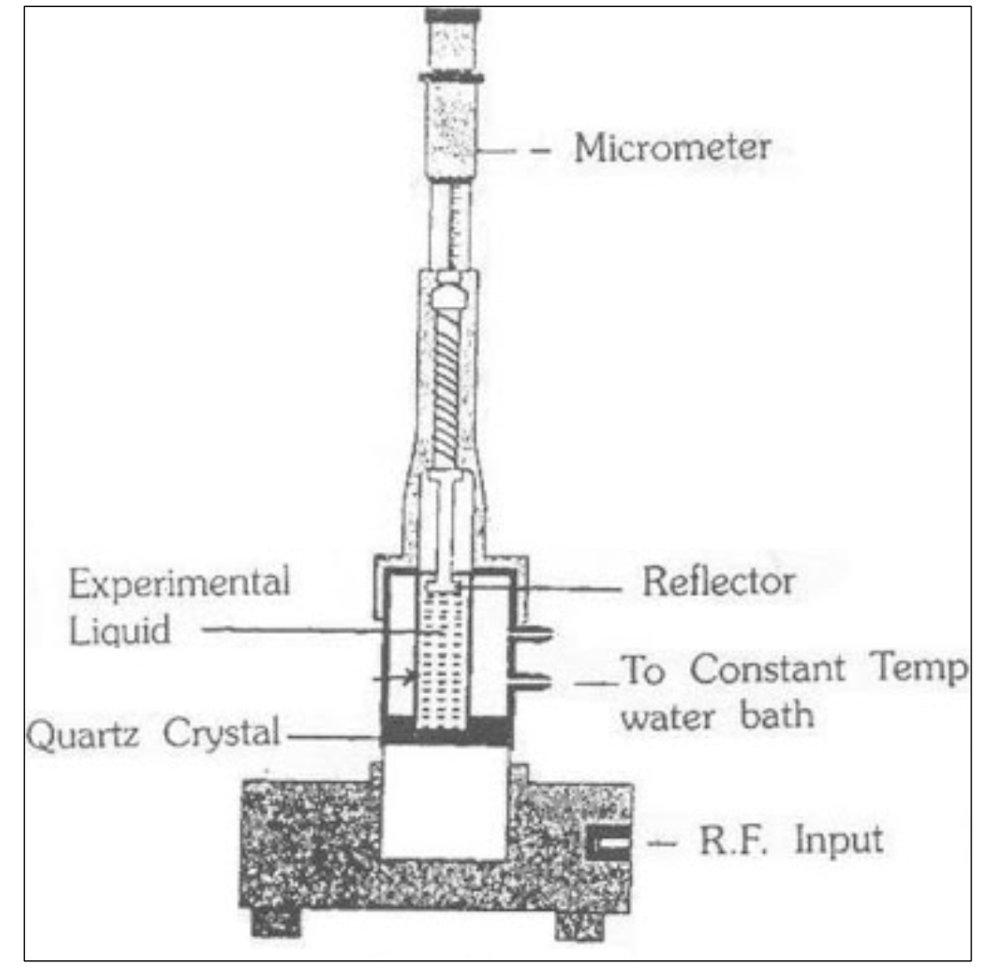

## Apparatus: 

Ultrasonic interferometer (High frequency generator, measuring cell), given liquid. 

## Formula
                                            

                                                           
## Principle

High frequency generator, which excites the quartz crystal, generates longitudinal ultrasonic wave in the experimental liquid. Standing waves are formed within the medium. This results in the formation of resonance and causes a change in the potential difference at the generator which excites the crystal. Due to this, anode current of the generator becomes maximum. The change in the anode current can be measured from the micrometer.

## Diagram

