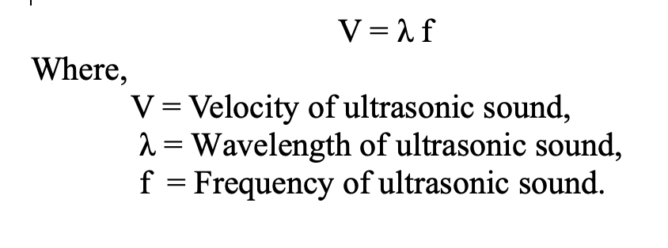
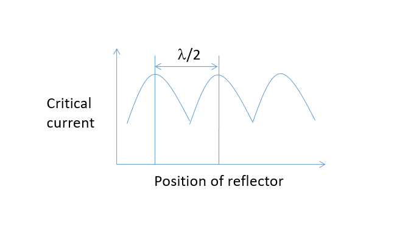
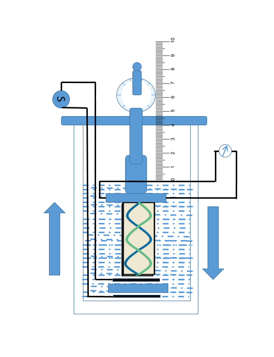

## Apparatus

Ultrasonic interferometer (High frequency generator, measuring cell), given liquid. 

## Formula

## Principle

High frequency generator, which excites the quartz crystal, generates longitudinal ultrasonic wave in the experimental liquid. Standing waves are formed within the medium. This results in the formation of resonance and causes a change in the potential difference at the generator which excites the crystal. Due to this, anode current of the generator becomes maximum. The change in the anode current can be measured from the micrometer.

## Theory

The determination of ultrasonic wave velocity in liquid media using an ultrasonic interferometer is based on the principles of interference of ultrasonic waves and their propagation through a medium. The determination of ultrasonic wave velocity in liquid media using an ultrasonic interferometer relies on the interference of waves, the measurement of wavelength, and the calculation of velocity based on the change in interference patterns.

This experiment is performed to measure the speed of sound in various liquids. The ultrasonic waves generated by transducer crystal at the bottom of the cell passes through the liquid medium being studied. These waves travel to the receiver and reflected back from the metal plate, placed at a distance from the transducer in the liquid. The interference of to and fro waves is observed. The key to measuring the velocity of ultrasonic waves in the liquid is to determine the maximum current generated which occurs with the formation of standing wave pattern. The reflective wave is received by the same transducer and a meter indicates the position of the metal reflector is at node or anti node. Stationary wave pattern may be generated in the liquid.

The principle used in the measurement of velocity (V) is based on the accurate determination of the wavelength (&lambda;) in the medium. If the separation between these two plates is exactly a whole multiple of the ultrasound signal wavelength, standing waves are formed in the medium. There will be an acoustic resonance generated which will give rise to a maximum anode current. If the reflector is set now on two successive maxima or minima, the difference between the micrometer readings will be &lambda;/2. If the reflector is set at m^th^ and (n+m)^th^ maxima, then the difference between the micrometer readings ‘d’ is given as d= n*&lambda;/2 So, &lambda;= 2* d/n
The frequency of transducer crystal is fixed initially and once the wavelength is calculated by performing the experiment, the velocity (V) can be obtained by the relation: V = f \* &lambda;.

When performing this experiment, various factors such as temperature, pressure, and the composition of the liquid may affect the velocity of ultrasonic waves. These factors need to be taken into account during the experiment and analysis.

## Diagram

